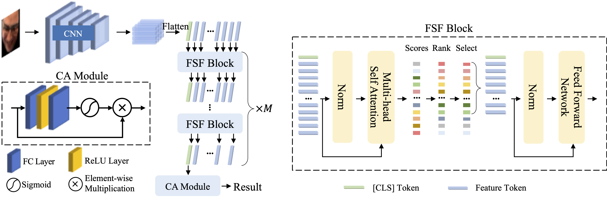

# FSFNet

This work presents **FSFNet**, our solution for the eye contact detection task in MultiMediate2024.

Fuyan Ma, Yiran He, Bin Sun, Shutao Li. [**"Less is More: Adaptive Feature Selection and Fusion for Eye Contact Detection"**](./assets/paper.pdf). ACM Multimedia 2024.



## Citation

If you find this repo useful for your research, please consider citing the paper as follows:

```bibtex
@inproceedings{ma2024less,
  title={Less is More: Adaptive Feature Selection and Fusion for Eye Contact Detection},
  author={Ma, Fuyan and He, Yiran and Sun, Bin and Li, Shutao},
  booktitle={Proceedings of the 32nd ACM International Conference on Multimedia},
  note = {doi: {https://doi.org/10.1145/3664647.3688987.}}
  year={2024}
}

@article{ma2021facial,
  title={Facial expression recognition with visual transformers and attentional selective fusion},
  author={Ma, Fuyan and Sun, Bin and Li, Shutao},
  journal={IEEE Transactions on Affective Computing},
  volume={14},
  number={2},
  pages={1236--1248},
  year={2021},
  publisher={IEEE}
}

@article{ma2023transformer,
  title={Transformer-augmented network with online label correction for facial expression recognition},
  author={Ma, Fuyan and Sun, Bin and Li, Shutao},
  journal={IEEE Transactions on Affective Computing},
  volume={15},
  number={2},
  pages={593--605},
  year={2023},
  publisher={IEEE}
}
```